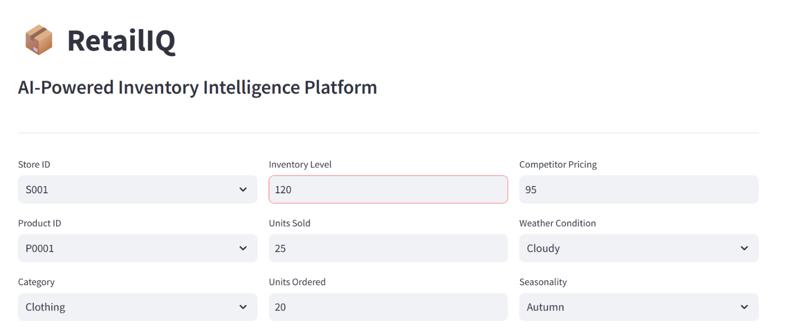
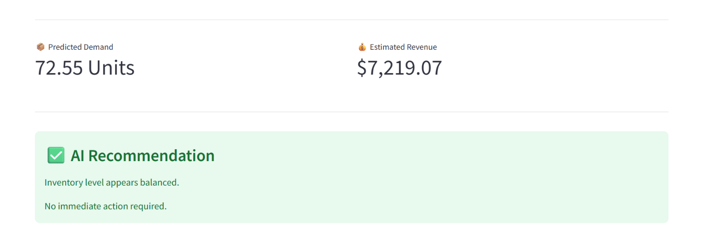

# 📦 RetailIQ  
# AI-Powered Inventory Intelligence Platform



RetailIQ is an **AI-powered inventory demand forecasting platform** designed to help businesses make smarter inventory decisions using Machine Learning.

The platform predicts product demand, estimates future revenue, analyzes inventory conditions, and provides intelligent recommendations to prevent stock shortages and reduce overstocking.

Built using **Python, Machine Learning, and Streamlit**, RetailIQ converts retail data into actionable business insights through an interactive analytics dashboard.

---

# 🚀 Project Overview

Inventory management is one of the biggest challenges in the retail industry.

Incorrect inventory planning can result in:

- ❌ Stock shortages
- ❌ Excess inventory
- ❌ Revenue loss
- ❌ Poor supply chain decisions

RetailIQ solves this problem by using historical retail data and machine learning algorithms to forecast demand and provide inventory optimization recommendations.

---

# ✨ Features

## 🤖 AI Demand Forecasting

Predicts future product demand using a machine learning regression model.

The final prediction engine uses:

- XGBoost Regression
- Feature Engineering
- Data Preprocessing Pipeline
- Hyperparameter Optimization


---

## 📊 Inventory Intelligence Dashboard

The application provides:

- Predicted demand
- Estimated revenue
- Inventory analysis
- Business recommendations


---

## 🧠 AI-Based Recommendations

RetailIQ automatically analyzes prediction results and provides recommendations.

### ⚠ Restock Recommendation

Generated when:

```
Predicted Demand > Available Inventory
```

Helps prevent stock shortages.


### 📦 Overstock Alert

Generated when:

```
Inventory >> Predicted Demand
```

Helps reduce excess stock.


### ✅ Balanced Inventory

Generated when inventory levels match expected demand.

---

## 📋 Prediction History

The dashboard stores previous predictions including:

- Timestamp
- Store ID
- Product ID
- Category
- Inventory Level
- Predicted Demand
- Estimated Revenue
- Inventory Status

Users can:

- View previous predictions
- Download history as CSV


---

# 🏗️ Project Architecture


```
Retail Dataset
        |
        ↓
Data Cleaning & Analysis
        |
        ↓
Feature Engineering
        |
        ↓
Data Preprocessing
        |
        ↓
Machine Learning Models
        |
        ↓
XGBoost Optimization
        |
        ↓
Saved ML Pipeline
        |
        ↓
Streamlit Dashboard
        |
        ↓
Business Insights
```

---

# 📂 Repository Structure


```
AI-Powered-Inventory-Intelligence-Platform/

│
├── app.py
│
├── model/
│   ├── retailiq_model.pkl
│   ├── preprocessor.pkl
│   └── dropdown_values.pkl
│
├── notebook/
│   └── AI-Powered Inventory Intelligence Platform.ipynb
│
├── screenshot/
│   ├── home.png
│   └── prediction.png
│
├── requirements.txt
│
└── README.md
```

---

# 🧪 Machine Learning Workflow

## 1. Dataset Collection

Dataset used:

**Retail Store Inventory and Demand Forecasting Dataset**

Source:

https://www.kaggle.com/datasets/atomicd/retail-store-inventory-and-demand-forecasting


---

## 2. Exploratory Data Analysis

Performed:

- Dataset exploration
- Correlation analysis
- Feature relationship analysis
- Demand pattern analysis


---

## 3. Feature Engineering

Created additional features:

### Date Features

- Year
- Month
- Day
- Day of Week
- Weekend Indicator


### Inventory Features

- Inventory to Sales Ratio


### Pricing Features

- Price Difference between competitor pricing and product price


---

## 4. Data Preprocessing

Techniques used:

- One Hot Encoding
- Column Transformer
- Feature transformation pipeline


---

# 🤖 Machine Learning Models

Multiple regression models were trained and evaluated:

| Model | Purpose |
|---|---|
| Random Forest | Baseline model |
| Gradient Boosting | Ensemble learning |
| Extra Trees | Feature analysis |
| XGBoost | Final optimized model |


---

# ⚡ Model Optimization

Hyperparameter tuning performed using:

- RandomizedSearchCV
- Cross Validation
- R² Score Optimization


The optimized XGBoost model was selected for deployment.

---

# 🛠️ Technology Stack


## Programming Language

- Python


## Machine Learning

- Scikit-Learn
- XGBoost


## Data Processing

- Pandas
- NumPy


## Visualization

- Matplotlib
- Plotly


## Application Framework

- Streamlit


## Model Storage

- Joblib


---

# ⚙️ Installation


## Clone Repository

```bash
git clone https://github.com/muskanbodthewar/AI-Powered-Inventory-Intelligence-Platform.git
```


Move into project directory:

```bash
cd AI-Powered-Inventory-Intelligence-Platform
```


Install dependencies:

```bash
pip install -r requirements.txt
```


---

# ▶️ Run Application


Start Streamlit application:

```bash
streamlit run app.py
```


The dashboard will open in your browser.

---

# 📸 Screenshots


## Dashboard


## Prediction Result




---

# 📊 Business Value

RetailIQ helps businesses:

✅ Improve inventory planning  
✅ Reduce stockouts  
✅ Minimize excess inventory  
✅ Improve revenue forecasting  
✅ Support data-driven decisions  


---

# 🔮 Future Improvements


Future enhancements:

- Real-time inventory database integration
- Cloud deployment
- Automated purchase recommendations
- Advanced forecasting models
- User authentication
- Multi-store analytics
- Real-time business monitoring


---

# 👩‍💻 Author


## Muskan Bodthewar


GitHub:

https://github.com/muskanbodthewar


---

# ⭐ Support

If you find this project useful, consider giving the repository a star ⭐
